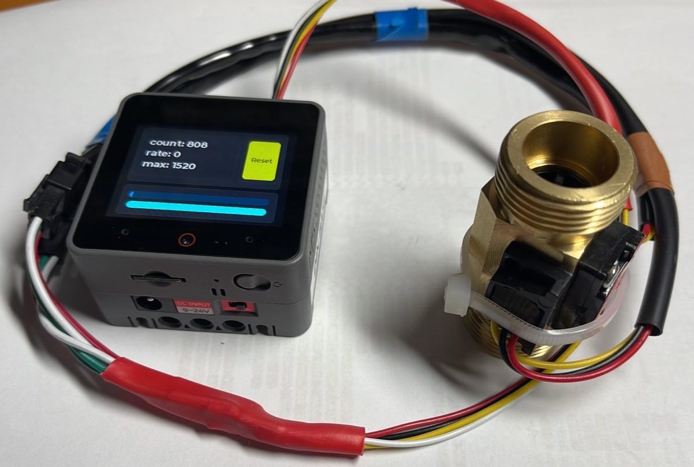
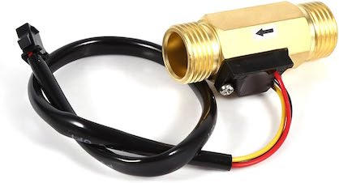
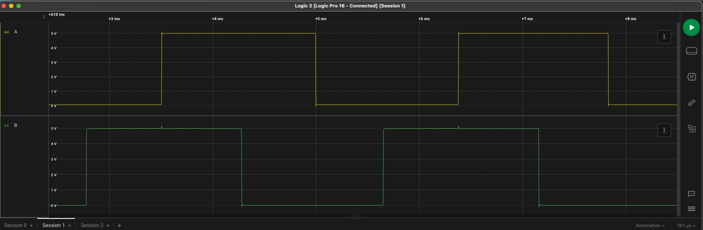
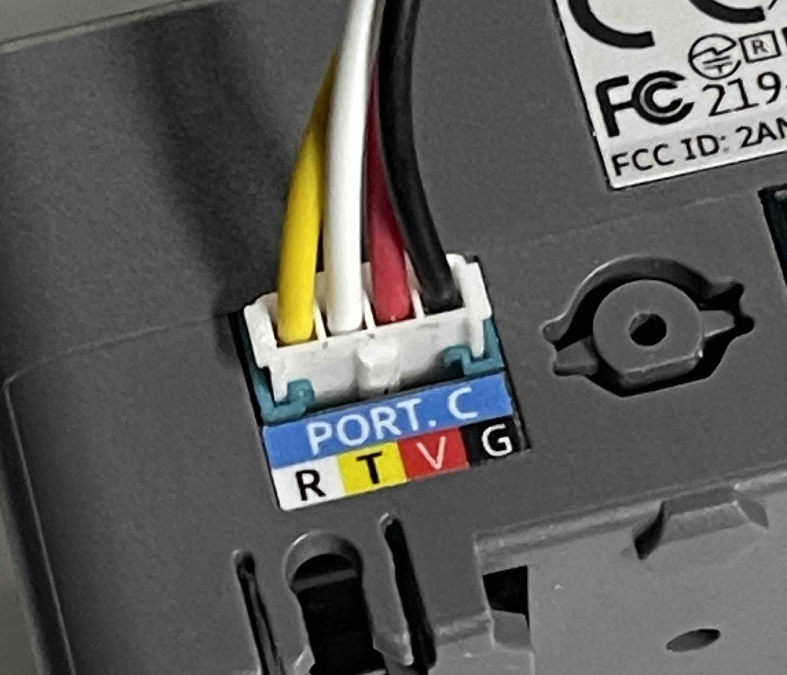

# Flow Sensor with BLE and LVGL UI




# what it does
FlowSensor can read out Chinese flow sensor found all over Alibaba and [Amazon](https://www.amazon.de/Water-Sensor-Piece-Tankless-Heater/dp/B08FDZS9C8) like these:



These sensors have a turbine wheel with a magnet, and a Hall sensor attached. As designed, a simple counter suffices to read the flow.

Unfortunately these sensors have serious drawbacks: vibrations - for instance caused by a running pump - can cause bouncing on the sensor signal, even if there is no flow at all (eg vent shut).

To fix this, I came up with an experimental contraption: the same mechanics, but two Hall sensors arranged in 90°. This creates a [quadrature encoder](https://en.wikipedia.org/wiki/Incremental_encoder) which is immune to ringing on any single sensor line:


This is a scope shot of the analog signal:


# modes

This code can deal with unmodified counter-style sensors as well as quadrature encoders. Select the appropriate target in platformio.

# platforms
while this should easily run on any ESP32 platform, right now only the M5Stack CoreS3 is supported.

## Build

````
git clone  https://github.com/mhaberler/flowsensor.git 
cd flowsensor/
git submodule update --init --recursive

````
Choose target,  build and upload.

# Pin connections
I used pins 17 and 18 on the Port C (blue) connector of the CoreS3. See https://docs.m5stack.com/en/core/CoreS3 for alternatives


# User interface

This was built with Squareline Studo, the project lives under `squareline-ui`.

If you make changes, export the UI files to `src/ui` 

# BLE Reporting
FlowSensor reports the values with BLE Advertising broadcast, like many other sensors, see https://decoder.theengs.io/devices/devices.html for devices working similarily.

## Manufacturer Data

Manufacturer ID: made up as 0x4711 - see https://www.4711.com/ for the rationale ;)

Data format:
`````
#ifndef MANUFACTURER_ID
#define MANUFACTURER_ID 0x4711 // https://www.4711.com/en/
#endif
#define FLAG_QUADRATURE 1

typedef struct __attribute__((packed)) {
  uint8_t mfidLow;
  uint8_t mfidHigh;
  uint8_t address[6]; // iOS workaround stupid UUID scheme
  int32_t count;
  uint32_t last_change;
  int16_t rate;
  uint8_t batteryLevel;
  uint8_t flags;
} mfdReport_t;

``````

## nRF Connect screenshot


