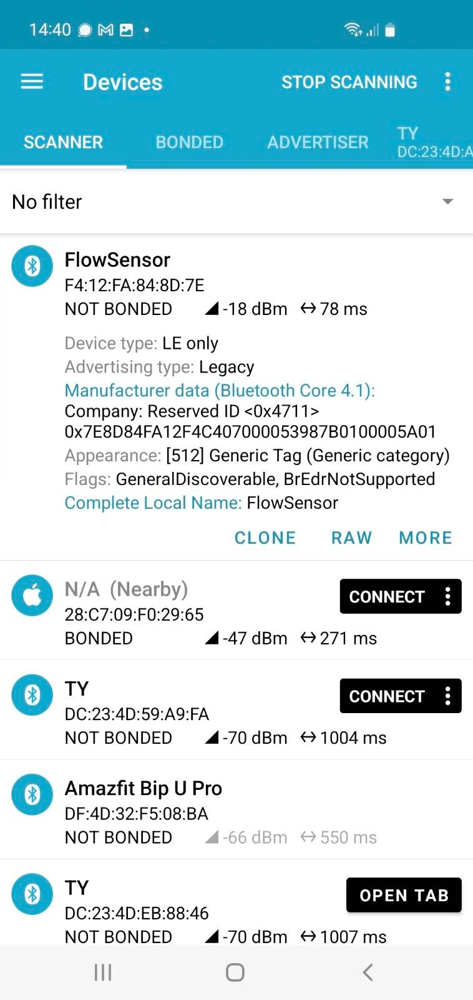

# Flow Sensor with BLE and LVGL UI


## Build

````
git clone  https://github.com/mhaberler/flowsensor.git 
cd flowsensor/
git submodule update --init --recursive

````
Choose target and build.

# User interface

This was built with Squareline Studo, the project lives under `squareline-ui`.

If you make changes, export the UI files to `src/ui` 

# BLE Reporting
FlowSensor reports the values with BLE Advertising broadcast, like many other sensors, see https://decoder.theengs.io/devices/devices.html for devices working similarily.

## Manufacturer Data

Manufacturer ID: made up as 0x4711 - see https://www.4711.com/ for the rationale ;)

Data format:
`````
#ifndef MANUFACTURER_ID
#define MANUFACTURER_ID 0x4711 // https://www.4711.com/en/
#endif
#define FLAG_QUADRATURE 1

typedef struct __attribute__((packed)) {
  uint8_t mfidLow;
  uint8_t mfidHigh;
  uint8_t address[6]; // iOS workaround stupid UUID scheme
  int32_t count;
  uint32_t last_change;
  int16_t rate;
  uint8_t batteryLevel;
  uint8_t flags;
} mfdReport_t;

``````

## nRF Connect screenshot


